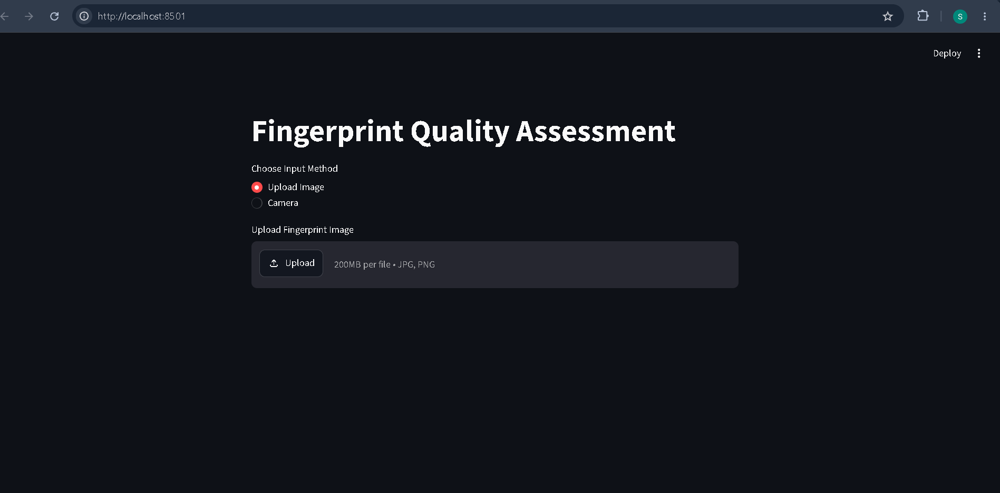
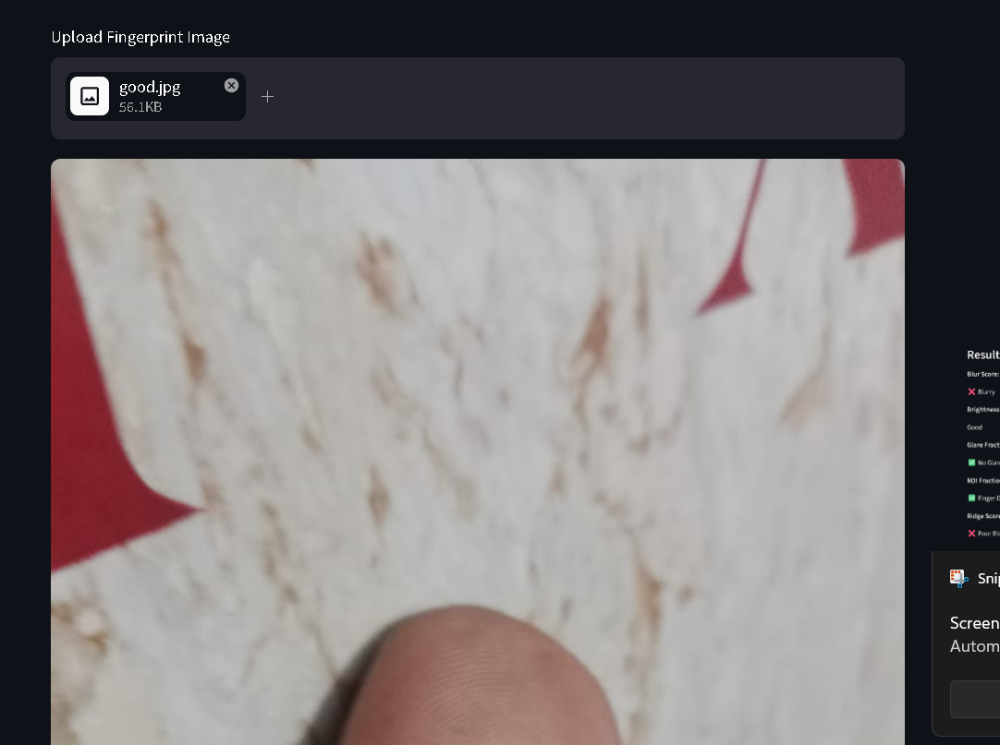
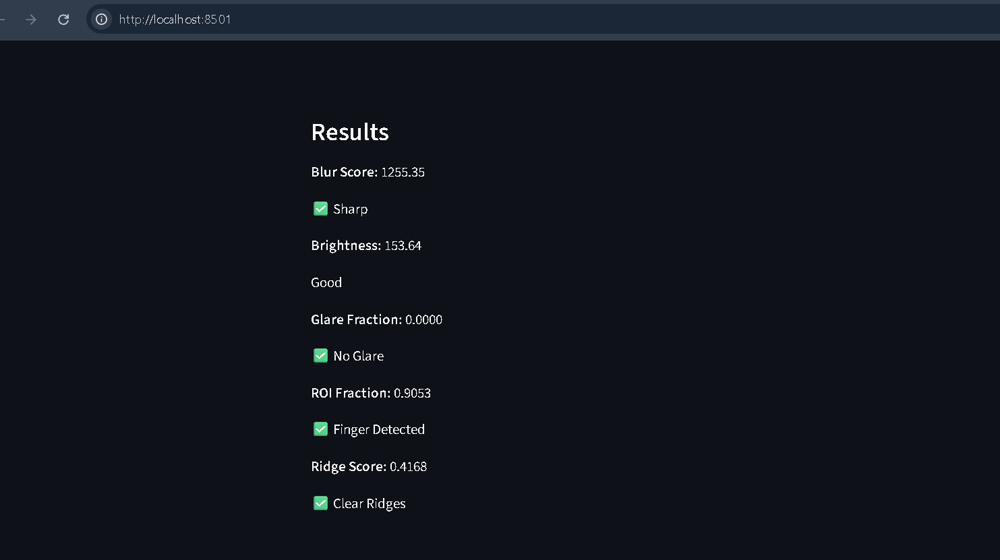
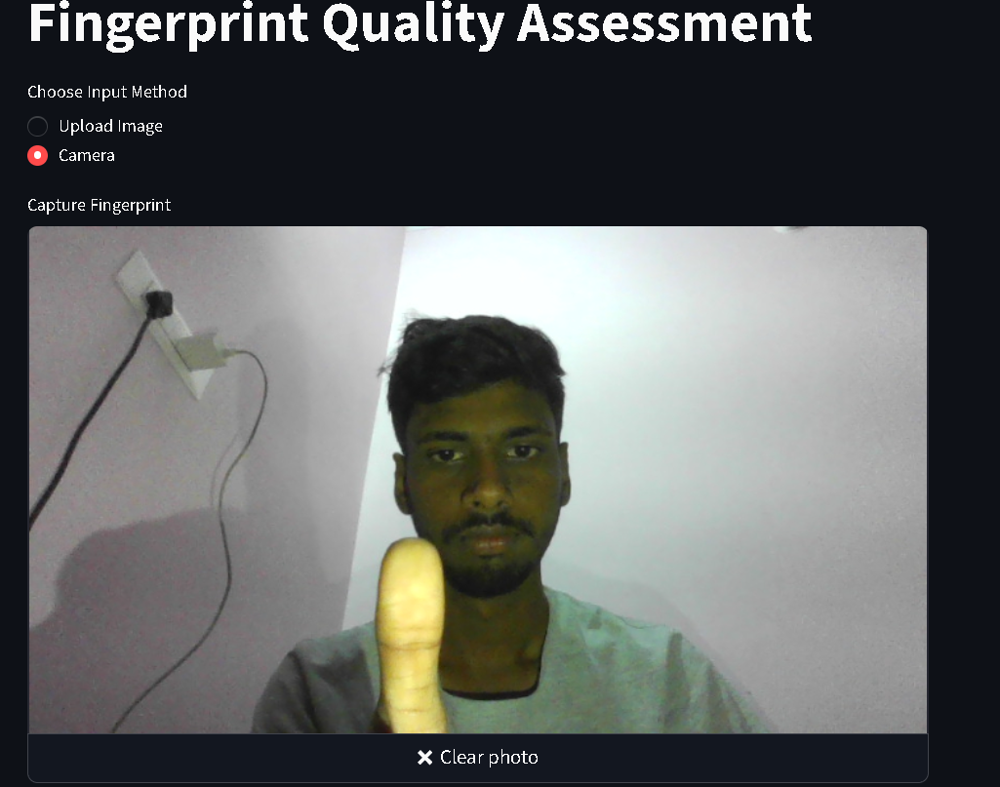

# Fingerprint Quality Assessment

## Features

- Blur Detection
- Brightness Detection
- Glare Detection
- ROI Detection
- Ridge Clarity Detection
- Streamlit Web Application

## Technologies Used

- Python
- OpenCV
- NumPy
- Streamlit

## Installation

```bash
pip install -r requirements.txt
```

## Run

```bash
python quality_assessment.py
```

## Streamlit

```bash
python -m streamlit run quality_app.py
```
## Application Screenshots

### Home Page



### Upload Fingerprint



### Results



### Camera Capture (Bonus)

